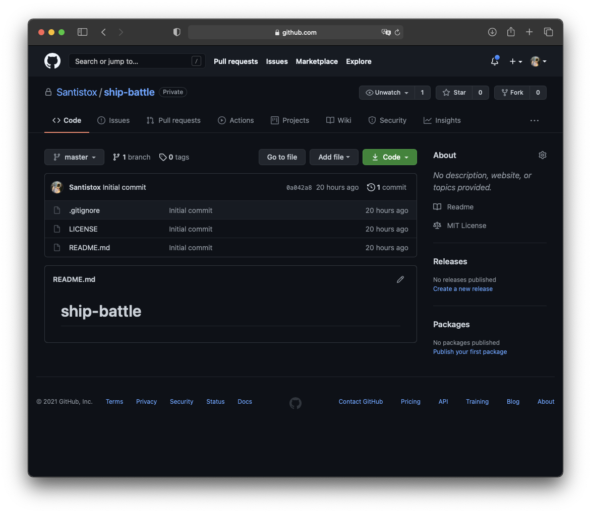

# Ship Battle 2021

 

Игры "Морской Бой" - классической выбор провести время, сражаясь с врагом на бумажном поле в клеточку. Но время не стоит на месте, поэтому мы предлагаем окунуться в осовремененную версию морских баталий и уже на компьютере.На выбор предлагаются процедурно генерируемые карты разного уровня сложности.

В игре присутствует развитая экономика, которая позволяет сделать игровой опыт более интересным и затягивающим.

4 класса военных кораблей имеющих возможность улучшений вооружения для захватывающих мирских баталий.

## Скриншоты из игры

## Использование библиотек

Для создания данного проекта использовались следующие библиотеки:

- [SQLite3](https://www.sqlite.org/index.html) - компактная встраиваемая СУБД.

Все остальные вспомогательные и конкретные версии указаны в файле с зависимостями [requirements.txt](requirements.txt).

## Авторские права

[MIT License](LICENSE)

- __[Aleksandr Gerasimov](https://github.com/Santistox)__

    @Santistox is the current maintainer of the code and has written much of the
    current code base, including a complete refactor of the core for stable version.

  - Source code
  - Design
  - Refractoring
  - Testing
